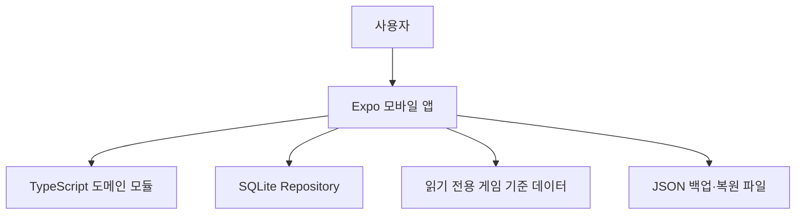

# 모동숲 다이어리 모바일 앱 아키텍처 설계서

문서 상태: Draft v2.4
최종 수정일: 2026-09-04
기준 문서: 모바일 SRS v2.5

## 1. 목적과 범위

본 문서는 React Native + Expo 기반 모동숲 다이어리 모바일 앱의 아키텍처를 정의한다. 모바일 앱은 서버와 로그인 없이 SQLite에 기록을 저장하며, 웹앱의 HTTP·FastAPI 계층을 포함하지 않는다. 현재 저장소에서는 `acnh-diary-mobile/`을 단일 Expo 앱으로 사용한다. 첨부 요구사항에서 제시한 대분류·소분류 순서는 제품 계약으로 고정한다.

### 1.1 아키텍처 목표

- 오프라인 우선 조회·기록
- 여러 섬의 사용자 데이터 완전 격리
- 기준 데이터와 사용자 기록의 독립 배포·마이그레이션
- 오늘·주민·도감·카탈로그 MVP의 빠른 화면 전환
- JSON 백업·복원과 데이터 버전 호환
- 카탈로그·공략·날씨를 나중에 추가할 수 있는 확장 경계

### 1.2 확정 결정

1. 앱 런타임은 React Native + Expo + TypeScript다.
2. 사용자 데이터 저장소는 `expo-sqlite`다.
3. 기준 데이터는 앱 번들 JSON 또는 읽기 전용 SQLite로 제공한다.
4. 모바일 앱은 인증·FastAPI·Supabase·웹 자동 동기화를 사용하지 않는다.
5. 날짜·출현·월별 신규·종료·필터·상태 규칙은 순수 TypeScript 도메인 모듈에 둔다.
6. 상세 화면은 모바일 독립 스크린으로 제공한다.
7. 라우팅은 Expo Router를 사용하고 `acnh-diary-mobile/src/app/`을 공식 화면 루트로 사용한다.
8. 기준 데이터 원문 필드명과 각 원천 데이터의 키는 유지하고, 사용자 화면 표시명은 locale 기반 UI 라벨 맵 JSON으로 관리한다.
9. 현재 출시 검증 대상은 iOS 16.0+이며 Android 9.0(API 28+)는 후속 플랫폼으로 둔다.

### 1.3 iOS 실행 기준

현재 Phase 0은 iOS만 검증한다. React Native 0.86.3 네이티브 빌드에는 Xcode 16.1 이상이 필요하며, 저장소에서 Xcode 26.3 빌드를 확인했다. Xcode 26 계열에서는 `patches/expo-modules-jsi+57.0.6.patch`를 `patch-package`로 자동 적용한다. Android 네이티브 빌드는 후속 플랫폼 단계에서 추가한다.

## 2. 시스템 컨텍스트



앱은 기기 시각과 앱에 번들된 기준 데이터를 사용한다. 개인 기록은 SQLite에 저장하고, 백업·복원은 사용자가 선택한 파일 URI를 통해 수행한다. 네트워크는 기준 데이터 업데이트나 외부 링크를 여는 선택적 기능이며 핵심 사용 흐름의 전제조건이 아니다.

## 3. 모듈 경계

### 3.1 `acnh-diary-mobile/src/app`

- Expo Router route root
- Expo Router route와 layout
- 화면·컴포넌트·접근성
- 앱 초기화 흐름과 lifecycle orchestration
- 파일 선택·공유·백업 UI

SQLite 쿼리와 migration은 `src/db`(Phase 0) 또는 `src/storage`(Phase 1 이후)에 두며, `src/app`의 route는 초기화 Use Case만 호출한다.

### 3.2 `acnh-diary-mobile/src/domain`

- 게임 날짜 계산
- 반구·월·전월 순환
- 생물 출현 판정
- 오늘 화면 생물의 월별 신규·종료 계산
- 주민 탭 selector
- 도감 필터·정렬·표시 단위
- 루틴 유효기간과 완료 상태
- 컬렉션 상태 허용 필드 검증

### 3.3 `acnh-diary-mobile/src/data`

- `dataset/app-ready/`의 앱용 기준 데이터를 도메인 모델로 정규화
- 주민 기준 데이터는 `villager_id` 문자열 키를 사용하는 417명으로 고정
- ACNHAPI·Norviah·Nookipedia 등 파일별 원천 출처와 데이터 버전 보존
- 원문 필드명과 UI 표시명 분리: raw key 유지, locale label map으로 한국어/영어 라벨 제공
- `dataVersion`, `sources`, `sourceUrls`, `updatedAt` 메타데이터
- 곤충·물고기·해산물·화석·미술품·주민·카탈로그 데이터
- 이미지 URI와 상세 필드의 nullable 처리

### 3.4 `acnh-diary-mobile/src/storage`

- SQLite schema와 migration
- 기준 데이터 reader
- 사용자 기록 Repository
- 백업 export/import serializer

### 3.5 `acnh-diary-mobile/src/ui/tokens`

- 둥근 모서리
- 파스텔 계열 색상
- 간격·타이포그래피
- 상태 아이콘과 접근성 색상 대비 토큰

## 4. 계층 구조

```text
Screen
  └─ Feature Hook / ViewModel
       └─ Application Use Case
            ├─ Domain Policy
            └─ Repository Interface
                 └─ SQLite / Bundled Data Adapter
```

- 화면은 SQLite 쿼리나 도메인 계산을 직접 호출하지 않는다.
- Use Case는 활성 섬과 기준 날짜를 명시적으로 받는다.
- Domain은 파일·SQLite·React Native API에 의존하지 않는다.
- Repository는 저장 방식이 바뀌어도 Use Case 계약을 유지한다.

## 5. 오프라인 우선 데이터 흐름

1. 앱 시작 시 SQLite 연결과 migration을 완료한다.
2. `src/data/`에 번들된 기준 데이터 manifest의 버전과 원천 출처를 확인한다.
3. 활성 섬을 조회한다.
4. 화면은 기준 데이터와 islandId별 사용자 기록을 결합한다.
5. 사용자가 상태를 변경하면 Use Case가 먼저 입력을 검증한다.
6. SQLite transaction이 성공한 뒤 화면 상태를 갱신한다.
7. 앱 재실행 시 SQLite를 다시 읽어 동일한 상태를 복원한다.

쓰기 성공 전 화면에 완료 상태를 확정하지 않는다. 낙관적 갱신을 사용하는 경우 실패 시 이전 상태로 되돌린다.

## 6. 화면 아키텍처

### 6.1 Expo Router 루트 레이아웃

- `src/app/_layout.tsx` — ThemeProvider와 공통 Stack
- `src/app/index.tsx` — SQLite 초기화 결과에 따른 스플래시·온보딩·오늘 redirect
- `src/app/onboarding.tsx` — 온보딩 화면
- `src/app/islands.tsx` — 섬 추가·변경·수정·삭제 화면
- `src/app/(tabs)/_layout.tsx` — 하단 탭 레이아웃
- `src/components/AppBottomNav.tsx` — 공통 하단 내비게이션과 기록형·수집형 활성 상태
- `src/app/(tabs)/today.tsx` — 오늘 화면
- `src/app/(tabs)/villagers.tsx` — 주민 화면
- `src/app/(tabs)/encyclopedia.tsx` — 도감 화면
- `src/app/(tabs)/catalog.tsx` — 카탈로그 홈 화면
- `src/app/(tabs)/guides.tsx` — 준비 중 화면
- `src/app/villagers/[villagerId].tsx` — 주민 상세 화면
- `src/app/encyclopedia/[category]/[itemId].tsx` — 도감 상세 화면
- `src/app/catalog/[category]/index.tsx` — 카탈로그 대분류별 목록 화면
- `src/app/catalog/[category]/[itemId].tsx` — 카탈로그 상세 화면
- Modal은 route group 또는 `presentation: "modal"` 옵션으로 구성한다.

현재 구현된 도감 route는 홈, 카테고리 목록, 독립 상세 화면이며 카탈로그 route는 홈, 대분류별 목록, 독립 상세 화면을 제공한다. 주민 카드도 `/villagers/[villagerId]` 독립 상세 route로 이동하며 바텀시트를 사용하지 않는다. 오늘 화면의 드로어에서 섬 관리 route로 이동해 섬 전환·추가·수정·삭제를 수행한다. 카탈로그 탭은 아이템 목록을 직접 열지 않고 카탈로그 홈에서 12개 대분류를 선택하도록 한다. 목록·상세의 상태 변경은 활성 섬 기준으로 SQLite에 저장한다. 공략 상세와 설정 route는 후속 단계에서 추가하며, 설계된 route가 존재하지 않는 동안 placeholder route로 대체하지 않는다.

### 6.2 탭 구조

- `TodayTab`: 오늘 홈, 날짜 선택, 루틴·생물·NPC·캘린더
- `VillagersTab`: 주민 목록, 주민 상세
- `EncyclopediaTab`: 도감 홈, 카테고리 목록, 도감 상세
- `CatalogTab`: 카탈로그 홈, 12개 대분류 선택, 선택 카테고리의 소분류 탭·목록·검색·보유·상세 필터·정렬·카탈로그 상세
- `GuideTab`: Post-MVP placeholder와 향후 공략 스택

5개 탭은 `AppBottomNav`를 공통 사용한다. 탭의 구조·간격·안전 영역·표시/숨김 동작·활성 색상은 모두 공유하며, 화이트 바탕 위에 연두색 활성 상태·진한 연두색 활성 텍스트와 중립 회색 비활성 상태를 사용한다.

### 6.3 모바일 상세 화면

주민·도감·카탈로그 상세는 독립 화면으로 구성한다. 목록에서 상세로 이동할 때 `category`와 `itemId`를 route parameter로 전달하며, 저장 상태는 다시 Repository에서 읽어 목록과 동기화한다.

### 6.4 카탈로그 분류·반응형 규칙

카탈로그 홈은 `catalogCategories`의 고정 순서인 가구, 인테리어, 옷, 음악, 기타, 도구, 특수 아이템, 토용, 사진·포스터, 레시피, 시즌·이벤트 레시피, 리액션의 12개 대분류를 사용한다. 목록은 선택한 대분류만 조회하고, 가로 스크롤 소분류 탭은 SRS의 순서를 유지한다. 일반 대분류와 레시피는 `classification`을 소분류로 사용하고, 시즌·이벤트 레시피는 `recipeFilters`의 시즌·이벤트 종류를 소분류로 사용한다. 모바일은 1열, 768dp 이상은 2열로 렌더링한다.

### 6.5 도감·카탈로그 홈 시각 구조

도감 홈과 카탈로그 홈은 `CollectionHomeShell`을 공통 사용한다. 앱 화면 전체는 참고 시안의 색감만 반영한 아이보리 웜 화이트 캔버스를 사용하며, 별도의 배경 이미지·라운드 외곽 패널·장식 원은 배치하지 않는다. 공통 `AppTopBar` 아래에 수집률 요약 카드, 대분류 섹션 헤더, 2열 대분류 카드 그리드를 같은 순서로 배치한다. 요약 카드와 대분류 카드는 화면별 지표·색상만 주입하고 레이아웃·진행바·터치 피드백은 공유한다. 본문은 `#FFFCF5`, `AppTopBar`는 `#FFFDFC`, 하단 `AppBottomNav`는 `#FFFFFF`, 활성 탭과 주요 액션은 연두색(`#A7D18C`·`#79AC5F`) 계열, 보조 표면은 `#F0F8EA`·`#DCEFD2`, 본문 강조 텍스트는 `#3F4A43`, 경계선은 `#BCD9A8`으로 관리한다. 카테고리·상태 보조색은 핑크·블루·연노랑·연보라 계열의 밝은 색상으로 구성한다. 목록·상세 화면 역시 동일한 `AppTopBar` 높이·좌우 여백·하단 경계를 사용해 제목과 조회 영역의 시작선을 통일한다.

공통 필터는 검색·보유·미보유·번호/이름/획득방법 정렬·초기화를 제공한다. 가구·인테리어·옷에는 비매품 필터를 추가하고, 값이 존재하는 상세 필터만 노출한다. 상세 필터에는 스타일·색상·테마·시즌·시리즈·분류 태그·크기·기능·리폼 가능 여부·행운 아이템 여부·주문 가능 여부·입수처를 포함한다. 레시피에는 시즌·이벤트·재료·획득방법 그룹을 추가하며, 같은 그룹은 OR, 그룹 간에는 AND로 평가한다. 사진과 포스터의 수집 상태는 서로 다른 itemId로 저장하고 액자 사진 상태를 주민 `photoReceived`와 동기화한다.

NPC 전용 이미지가 현재 `dataset/app-ready` 오프라인 자산에 포함되어 있지 않으므로 오늘 화면은 NPC 이름을 유지하는 이니셜 대체 표시를 사용한다. NPC 이미지 자산이 추가되면 동일한 로컬 자산 맵을 연결하며 저장 모델과 화면 계약은 변경하지 않는다.

## 7. 저장소 아키텍처

### 7.1 사용자 기록

SQLite에 다음 데이터를 저장한다.

- islands, player_profiles
- routine_definitions, routine_logs
- collection_records
- villager_states, villager_residencies, campsite_visits
- npc_visits
- app_settings, schema_meta

섬에 종속된 사용자 테이블은 모두 `islandId`를 포함한다. `app_settings`, `schema_meta`, 기준 데이터 manifest는 앱 전역이므로 섬과 무관하다.

### 7.2 기준 데이터

기준 데이터는 읽기 전용이다. 권장 구성은 카테고리별 압축 JSON이며, 데이터가 커지면 읽기 전용 SQLite로 전환한다. 기준 데이터의 `itemId`는 사용자 `collection_records`와 연결되는 안정적인 키여야 한다.

카탈로그는 `src/data/content/catalog/catalog.json`에 12개 대분류의 기본 아이템 7,443개를 저장하고, `catalog-variations.json`에 24,897개 변형을 저장한다. 기본 아이템은 `catalogType/itemId`로 식별하고 `assetType/assetId`를 통해 Metro 정적 로컬 이미지에 연결한다. 각 대분류의 소분류 탭은 제품 요구사항에 정의된 순서를 우선하고, 일반 대분류와 레시피는 기본 아이템의 `classification` 값으로, 시즌·이벤트 레시피는 `details.recipeFilters`의 시즌·이벤트 키로 연결한다. 가구 변형은 `catalogType/itemId::variationId`를 수집 키로 사용해 보유 여부와 수량을 저장하며, 다른 유형은 동일한 키 형식으로 확장할 수 있다.

각 원천 데이터의 원문 키와 화면 표시명은 분리 관리한다. raw 데이터는 내부 필드명 그대로 유지하고, UI 라벨은 locale 기반 `ui-labels.json` 또는 `labels.ko.json`/`labels.en.json` 맵을 통해 해석한다. 도감 속성·미술품 작가·카탈로그 분류 및 레시피 필터는 이 표시 계층에서 한국어로 해석한다. 해당 맵은 같은 key 구조를 재사용해 영어 확장을 가능하게 한다.

### 7.3 기록과 기준 데이터 결합

```text
GameData(itemId, fields, dataVersion)
        +
CollectionRecord(islandId, itemId, states)
        ↓
Mobile ViewModel(item, state, displayFlags)
```

기준 데이터 갱신은 사용자 기록을 삭제하거나 덮어쓰지 않는다. 항목이 더 이상 존재하지 않으면 orphan record로 보존하고 복원·마이그레이션 화면에서 안내한다.

## 8. 핵심 도메인 정책

### 8.1 날짜

`manualDate ?? (localTime < 05:00 ? previousDate : localDate)`를 사용한다. 시간대는 섬 설정을 우선하고 기본값은 기기 시간대다.

### 8.2 오늘 화면 월별 생물 표시

- `newThisMonth`: 현재 게임 월에 출현하고 전월에는 출현하지 않음
- `leavingThisMonth`: 현재 게임 월에 출현하고 다음 게임 월에는 출현하지 않음
- 1월의 전월은 12월
- 12월의 다음 월은 1월
- 남반구는 기준 데이터의 반구별 출현 월을 사용한다.

오늘의 현재 출현 목록은 섬의 시간대에서 계산한 현재 시각과 선택한 게임 날짜의 반구별 월·시간 범위를 함께 평가한다. 현재 출현 목록의 각 생물에 월별 신규·종료 flag를 결합해 배지로 표시한다. `All day`는 하루 종일, 자정을 넘는 범위는 두 구간으로 처리한다. 날씨와 MeteoNook 데이터는 MVP에서 제외한다.

### 8.3 주민 상태

위시·현재 주민·과거 주민·캠핑장 방문은 독립 상태로 저장할 수 있다. 섬 외 주민은 저장하지 않고 selector에서 계산한다. 액자 사진 보유는 사진 collection record의 기준이며 주민 액자 탭은 이 상태에서 파생한다.

### 8.4 루틴 유효기간

루틴 정의 수정은 기존 행을 덮어쓰지 않는다. 오늘을 시작일로 하는 새 정의 버전을 만들고 이전 정의를 전날에 종료한다. 삭제는 유효 종료일을 설정한다. 루틴 로그는 당시 정의와 연결된 상태로 보존한다.

## 9. 백업·복원 아키텍처

### 9.1 Export

`BackupService.export()`는 모든 섬과 섬별 사용자 기록을 읽어 다음 envelope로 직렬화한다.

```json
{
  "schemaVersion": 1,
  "appVersion": "1.0.0",
  "exportedAt": "2026-08-29T12:00:00.000Z",
  "dataVersion": "app-data-2026-08",
  "islands": [],
  "profiles": [],
  "routines": [],
  "routineLogs": [],
  "collectionRecords": [],
  "villagerStates": [],
  "residencies": [],
  "campsiteVisits": [],
  "npcVisits": [],
  "appSettings": {}
}
```

파일은 사용자가 파일 앱에 저장하거나 공유할 수 있다. 백업 파일에는 비밀번호나 인증 토큰을 저장하지 않는다.

### 9.2 Import

1. 파일 URI에서 UTF-8 JSON을 읽는다.
2. 최대 파일 크기와 JSON 파싱을 검증한다.
3. `schemaVersion`을 확인하고 필요한 migration을 적용한다.
4. islandId와 참조 ID의 중복·누락을 검증한다.
5. 사용자에게 기존 데이터 교체 여부와 섬 개수를 확인시킨다.
6. SQLite 임시 transaction에 기록을 넣는다.
7. 무결성 검증 후 commit한다.
8. 실패하면 rollback하고 기존 DB를 유지한다.

## 10. 보안과 개인정보

- 서버 계정과 로그인 정보를 저장하지 않는다.
- SQLite 파일과 백업 파일에는 사용자 기록만 포함한다.
- 백업 파일을 외부 앱으로 공유할 때 운영체제 공유 UI를 사용한다.
- 파일 import 후 원본 파일 URI나 경로를 장기간 저장하지 않는다.
- 크래시 로그에 주민 상태와 개인 메모 원문을 포함하지 않는다.
- 외부 데이터 출처 링크는 읽기 전용으로 제공한다.

## 11. 성능·확장성

- 이미지 썸네일을 목록에서 사용하고 상세 원본은 지연 로드한다.
- 기준 데이터는 카테고리 단위 lazy load를 적용한다.
- 목록은 필터·정렬 결과와 페이지 단위 또는 가상화 리스트를 사용한다.
- collection_records에는 `(island_id, item_type, item_id)` 복합 인덱스를 둔다.
- 향후 `catalog_variant_records`를 추가해 변형별 보유·개수를 확장한다.
- `collection_records.quantity`와 `itemId::variationId` 키로 가구 변형별 보유·수량을 저장하고, 수량 범위는 0~999로 제한한다.
- 날씨와 공략은 별도 도메인 모듈로 추가하고 기존 SQLite migration을 깨지 않는다.

## 12. 테스트 전략

- Domain: 04:59/05:00, 수동 날짜, 반구·월 순환, 신규·종료 출현, 필터 조합, 정렬 방향
- SQLite: migration, islandId 격리, UPSERT 멱등, 루틴 버전·로그 보존, 마지막 섬 삭제 차단
- Backup: export/import round-trip, 잘못된 JSON, 지원하지 않는 schemaVersion, transaction rollback
- Screen: 탭 전환, 독립 상세, 상태 토글, 전체 체크·해제, 백업 확인 dialog, 라이선스 화면
- Device: 저사양 기기 스크롤, 앱 재실행, 네트워크 차단, 화면 회전·백그라운드 복귀

## 13. 출시 단계

### Phase 0

`acnh-diary-mobile/`에서 npm 의존성 설치, Expo 설정 확인, TypeScript 검사, 오프라인 Metro 시작, iOS 개발 빌드 실행을 검증한다. 웹은 최초 출시 플랫폼이 아니므로 모바일 기준선에 포함하지 않으며 Android는 후속 플랫폼 단계에서 검증한다.

### Phase 1

TypeScript 도메인 모듈, `src/data` 기준 데이터 adapter, SQLite migration, 디자인 토큰

### Phase 2

온보딩·섬 관리·오늘·주민·도감·카탈로그·상태 기록·독립 상세 화면

### Phase 3

백업·복원, 출처·라이선스 화면, 접근성·성능·기기 테스트, EAS Build

### Phase 4

카탈로그 변형 수집·공략·날씨·무값과 통계

## 14. 미정 또는 별도 결정

- 캘린더 이벤트는 현재 앱 번들 이벤트 날짜 데이터가 비어 있어 주민 생일을 우선 제공한다. 이벤트 데이터가 준비되면 동일한 날짜 ViewModel에 추가한다.
- 주민 상세의 원천 데이터에 없는 데뷔작·섬 주민 가능 여부·일부 색상은 값을 추정하지 않고 숨긴다.
- 기준 데이터 자동 업데이트 배포 방식
- 백업 파일 암호화 여부

## 15. 변경 이력

- v1.0 · 2026-08-29 · 모바일 앱 전용 아키텍처, SQLite·오프라인·백업·복원·출처 고지 설계 작성
- v1.1 · 2026-08-29 · Expo Router, 실제 앱 경로, 앱용 데이터셋 출처, 백업 계약과 실행 기준선 확정
- v1.2 · 2026-08-29 · iOS 우선 실행 기준과 Xcode·expo-modules-jsi 호환성 패치 기준 확정
- v1.3 · 2026-08-29 · SRS·SAD·SDS 버전 정렬, 초기화 위치와 Phase 0·1 경계 명시
- v1.4 · 2026-08-29 · 카탈로그 목록·상세·로컬 자산·기본 아이템 수집 구조를 MVP 범위에 반영
- v1.5 · 2026-08-29 · 카탈로그 탭을 홈·대분류·목록·상세 흐름으로 정렬
- v1.6 · 2026-08-29 · 대분류별 `classification` 소분류 탭과 필터 흐름 반영
- v1.7 · 2026-08-29 · 카탈로그 상세 필터 패널과 다중 선택 조건 반영
- v1.8 · 2026-08-30 · 첨부 요구사항의 오늘·섬 관리·카탈로그 세부 흐름, 고정 탭 순서, 레시피 필터, 반응형 목록, 변형 수집 계약 반영
- v1.9 · 2026-08-30 · 카탈로그 상세정보 기반 분류 태그·크기·기능·리폼·행운·주문 가능 여부 필터 반영
- v2.0 · 2026-08-30 · 주민 상세를 독립 route 화면으로 전환하고 주민 상세 경로·내비게이션 구조를 실제 구현과 정합화
- v2.1 · 2026-08-30 · 도감·카탈로그 홈을 공통 수집률·대분류 카드 구조로 통합하고 앱 전체 크림색 캔버스를 반영
- v2.2 · 2026-08-30 · AppBottomNav 공통 탭 구조와 기록형·수집형 파스텔 활성색을 아키텍처에 반영
- v2.3 · 2026-08-30 · 탭 그룹별 활성색을 제거하고 전 탭 공통 파우더 블루 팔레트로 통일
- v2.4 · 2026-09-04 · 레시피 기본 분류와 시즌·이벤트 레시피 종류별 소분류 탭 및 공통 언더라인탭 스타일 정합화
